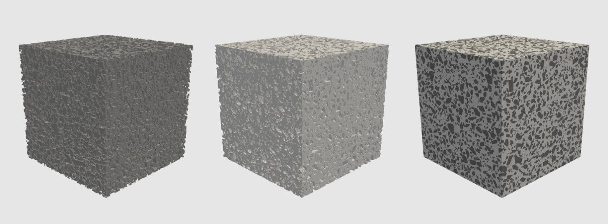

Tutorial
********************

_____________________________________________________________________
Generating an AB8 Mesostructure using an aggregate size distribution
_____________________________________________________________________

In order to generate a concrete mesostructure with a certain aggregate size distribution, we first need to specify the
total aggregate volume fraction in the concrete material and then the aggregate size distribution.
First create a csv file containing the aggregate size distribution.

The csv file should contain atleast two columns.
The first column lists the aggregate sizes while the second column the corresponding volume-fraction.
This volume fraction is relative to the total volume fraction of the aggregates in the material.
Here is the text file with a distribution for AB8 standard concrete.

.. csv-table:: An example csv file for AB8 concrete
   :file: ../../examples/AB8_CMG.csv
   :header-rows: 1
   :widths: 1,1

please do not forget to add the correct header.

Having specified the aggregate size distribution and given the total aggregate volume fraction, we have to option to
provide the 'average shape' of aggregate in terms of ellipsoidal radii. The first value must be 1 and the second and
third values are scaling factors that will scale the radii in the other dimensions with respect to the first dimension.

we can generate the required mesostructure as follows::

    #IMPORT THE NECESSARY LIBRARIES
    from generate_mesostructure import Mesostructure
    from configuration import Configuration
    from visualization import export_data, visualize_sections

    #SPECIFY THE TOTAL AGGREGATE VOLUME FRACTION AND AGGREGATE SIZE DISTRIBUTION
    my_configuration = Configuration(vf_max_assembly=0.3, average_shape = [1, 0.5, 0.5])
    my_configuration.load_inclusions(conf_csv='AB8_CMG.csv')

Now, we can specify the size of the REV-Mesostructure and add our configuration ::

    my_mesostructure = Mesostructure(mesostructure_size=[200, 200, 200])
    my_mesostructure.add_configuration(my_configuration)

Note, we can add multiple configurations (multiple standards) with various sizes. Here we just have one configuration.

Now we can generate the required concrete mesostructure, visualize and export the data using the following three lines.
::

    #GENERATE
    my_synthetic_microstructure =my_mesostructure.assemble_sra()
    # VISUALIZE
    visualize_sections(my_synthetic_microstructure, 2)
    #EXPORT
    export_data(my_synthetic_microstructure, 'vtk', 'mesostructure.vti')

That is it. We have generated our first mesostructure.

_______________________________________________
Generating a fully customized AB8 Mesostructure
_______________________________________________

Concrete Mesostructure in voxel format is generated by assembling inclusions of given size
onto the main assembly. Matrix (Cement) in the mesostructure is represented by voxel number 0
and inclusions (Aggregate) by 1, coating (ITZ) is represented by 2.  The process of
mesostructure generation involves first generating inclusion of given input details
and then assembling onto the main mesostructure.  To specify the concrete inclusion
details such as size, volume fraction etc. a Configuration object has to be first created.
This object is then loaded onto the Mesostructure object in which when the assembly method
is called, the inclusions are generated by importing details from the loaded Configuration
and assembled onto the mesostructure.  Inputs are provided for a family of inclusions.
Based on the maximum volume fraction specified for the family, required number inclusions
in that family is estimated and assembled.

To generate the concrete mesostructure using CMG, following are the instructions.
Import the required libraries as given in the following lines::

    from generate_mesostructure import Mesostructure
    from configuration import Configuration
    from visualization import export_data, visualize_sections
    import numpy as np

Firstly, Configuration object has to be created with maximum volume fraction for the current
configuration as the input ::

    my_configuration = Configuration(vf_max_assembly=0.4)

Followed this, inclusions input details in csv file have to be loaded to the configuration as
below ::

    my_configuration.load_inclusions(conf_csv=AB8_CMG_full.csv’)

Following input details must be/can be specified for the inclusion family to load to
the Configuration object.

1.	a: diameter of the inclusion along axis-1, default 10
2.	b: diameter of the inclusion along axis-2, default b=a*average_shape[1]
3.	c: diameter of the inclusion along axis-3, default c=a*average_shape[2]
4.	vf_max: Maximum volume fraction for the current inclusion family.
5.	coat: True/False for coating provision on the inclusion, default False
6.	t_coat: thickness of coating on the inclusion, default 0
7.	space: True/False for providing spacing between inclusions in the assembly, default False
8.	t_space	: thickness of the spacing on the inclusion (similar to coating), default 0

Note: vf_max is relative to
the maximum volume fraction of the inclusion given for the entire assembly. For example, for the mesostructure assembly,
if the maximum volume fraction is 0.5, then total maximum volume fraction of all inclusion families (all rows in input csv file)
should be equal to 1 since it is relative to the maximum volume fraction of the assembly.

An example csv input file template is given below.

.. csv-table:: An example csv file for AB8 concrete
   :file: ../../examples/AB8_CMG_full.csv
   :header-rows: 1
   :widths: 1,1,1,1,1,1,1,1,1,1,1,1

Column header name should be same as the input names given above, but position of the columns
can be changed and non-mandatory input columns can be removed.

Followed with this, Mesostructure object is created with mesostructure size and configuration
as input. Default mesostructure size is 100,100,100. Default resolution is 1,1,1. The resolution relates the
voxel dimensions and the phyiscal dimensions. For e.g. if the resolution is 0.5, 0.5, 0.5, and the mesostructure is 50, 50, 50 mm
then each mm3 is equal to 2x2x2 voxels. So, it is not mandatory to load this value.
Also configuration can be separately added by using ‘add_configuration’ method ::

    my_mesostructure = Mesostructure(mesostructure_size=[200,200,200]),
    my_configuration, resolution = [0.5, 0.5, 0.5]

or ::

    my_mesostructure = Mesostructure(mesostructure_size=[200,200,200])
    resolution = [0.5, 0.5, 0.5]
    my_mesostructure.add_configuration(my_configuration)

Finally, assembly of the inclusions as per the details given in the configuration is done using
CMG Semi-Random Assembly (SRA) algorithm.
This algorithm assembles the inclusions at random locations, but with CMG optimization.
SRA algorithm is called as follows::

    asmbly.assemble_sra()

The algorithm tries to assemble the inclusions till maximum volume fraction is achieved.
Since the assembly is at random points, it becomes difficult to fit the inclusions into
the mesostructure as the packing density increases. So, assembly time increases with the
given maximum volume fraction. To terminate the process after some time, a parameter
attempt_max is given which gives a limit on how many failed attempts to assemble
the inclusion can be made.  This parameter can also be given as input to the method if required.
Also, there is a threshold value beyond which the algorithm shifts from completely
random assembly to semi-random to accommodate more inclusions.
This threshold value can also be given as input. More the threshold value,
more random the assembly is (more slow!). ::

    my_synthetic_microstructure = asmbly.assemble_SRA(attempt_max=500000, threshold=50)

here my_synthetic_microstructure is the voxel representation of the mesostructure (3D array, int).
Mesostructure can be exported to different types of output files for either visualization or
some other analysis by using following code ::

    exportData(data= my_synthetic_microstructure, export_type=’vtk’, fileName=’mesostructure.vti’)

or ::

    exportData(data= my_synthetic_microstructure,
         export_type=’csv’, fileName=’mesostructure.csv’)

vtk, csv, npy, npz, txt export types are allowed. Please note that the export type and extension
in the file name/location should be consistent (eg. vtk-vti, csv-csv, npy-npy etc.)
One can also visualize sections of the mesostructure using following code with the mesostructure
and number of input slices in each direction as arguments. Default value for argument slices
is 3. ::

    visualizeSections(my_synthetic_microstructure, slices=5)

Here is the complete code to generate a concrete mesostructure for AB8 standard::

    from generate_mesostructure import Mesostructure
    from configuration import Configuration
    from visualization import export_data, visualize_sections

    my_configuration = Configuration(vf_max_assembly=0.3)
    my_configuration.load_inclusions(conf_csv='AB8_CMG.csv')
    my_configuration.sort_inclusions()
    my_mesostructure = Mesostructure(mesostructure_size=[200, 200, 200])
    resolution = [0.5, 0.5, 0.5]
    my_mesostructure.add_configuration(my_configuration)
    my_synthetic_microstructure =my_mesostructure.assemble_sra()
    visualize_sections(my_synthetic_microstructure, 2)
    export_data(my_synthetic_microstructure, 'vtk', 'mesostructure.vti')
